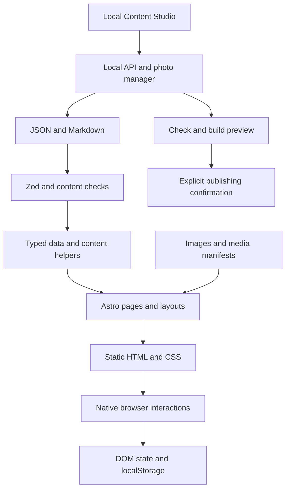

# Formulasearch 产品体验、交互与性能审查

日期：2026-09-05。审查基线：`main / d8ac7ed`。状态：**仅审查，等待确认执行范围**。

本轮没有修改业务代码、内容清单、配置或依赖，没有执行保存内容、删除、发布、commit 或 push。新增本报告，测试与截图保存在已有忽略规则覆盖的 `output/playwright/audit-2026-09-05/`。构建产生本地生成文件。

## 结论

项目已经有明确的个人品牌、真实内容、静态生成体系和比较扎实的质量检查，适合做局部打磨。**最值得投入的方向是图片交付、移动阅读、键盘与语言状态、媒体反馈，而不是换框架或重写组件。**

本报告列出 **25 项：P0 2 项、P1 12 项、P2 7 项、P3 4 项**。优先级与证据强度分开：P0 表示阻断关键流程或已测得的严重性能问题；源码风险不会写成已发生的线上事故。

最强证据：

- 首页两个很小的主题头像合计下载约 **3.12 MB**；模拟手机弱网冷启动两次 LCP 分别为 **16.752s、16.724s**。
- Projects 模拟手机加载约 **4.39 MB**；其中一组尚在首屏之外的浅／深主题 PNG 封面占约 **3.28 MB**。
- H3 示例长文章在 390px 宽度下，默认展开的目录高约 **1,149px**，正文起点约 **1,714px**。
- Skills 用键盘切换后，焦点仍停在 `aria-hidden="true"`、`tabindex="-1"` 的旧卡片。
- 本机 Windows 上，后台采用的 `spawn('npm.cmd', ...)` 调用方式，通过无副作用的 `--version` 调用复现 `spawn EINVAL`。

视觉判断：没有充分理由推翻当前风格。点阵底纹、衬线与无衬线搭配、细线分隔、克制配色和作品图主体形成了可辨识的语言。玻璃导航有明确位置与用途，不应仅因“使用玻璃效果”就判定为模板化。真正拉低完成度的是空标签、混合语言、操作后焦点丢失、等待过长等具体细节。

## 1. 项目结构与用户流程

### 产品与用户

这是 Phil 的个人实践总站：集中呈现 AI／设计文章、独立产品、Skills、实验课程、摄影及建筑作品，帮助访客了解作者、找到可阅读或可使用的成果，并通过邮箱和社交渠道联系。

从当前内容推断，主要用户有四类；尚无访问统计或访谈数据来确认其占比：

| 用户 | 想完成的事 | 主要路径 |
| --- | --- | --- |
| 读者与学习者 | 找方法、教程、案例 | Blog → 分类／文章 → 目录／视频 → 相关阅读 |
| 产品与设计访客、潜在合作方 | 看作品、理解能力、体验产品 | 首页 → Projects／Architecture → 详情 → 外部产品／联系 |
| 工具使用者 | 找到合适 Skill 并安装 | Skills → 样例 → GitHub 安装说明 |
| 站点作者 | 更新内容并可靠发布 | Content Studio → 编辑／照片 → 生产预览 → 确认发布 |

### 技术与目录

```text
Formulasearch
├─ content/
│  ├─ site/               导航、双语文案、目录、媒体与站点 manifest
│  ├─ blog/*/index.md     Blog 单一正文来源
│  └─ architecture/*/     建筑项目资料
├─ src/
│  ├─ pages/              中英文公开路由、动态详情、RSS／Sitemap／llms
│  ├─ layouts/            Base → Blog／Catalog → 文章布局
│  ├─ components/         内容组件、导航、画廊、图标入口
│  ├─ data/               JSON 解析、Zod 校验、关联关系校验
│  ├─ lib/                路由外的共享内容、双语、推荐、序列化逻辑
│  ├─ styles/             全局、博客、玻璃、声音预览样式
│  ├─ assets/             Astro 处理的建筑图片等资产
│  └─ content-studio/     本地管理页、API、照片处理
├─ public/                直接交付的脚本、图片、视频、音频和官方品牌资源
├─ scripts/               媒体准备、校验、构建、预览、发布
├─ tests/                 Playwright 浏览器回归
├─ docs/                  设计与维护说明
└─ refs/                  参考研究与独立试验材料
```

技术栈：Astro 7 静态生成、TypeScript／Zod、原生 JavaScript、CSS、Astro Image／Sharp、Lucide。Tailwind 4 和 daisyUI 用于本地后台；React 19、Keystatic 通过 `CONTENT_STUDIO=1` 条件启用。公开生产站没有 React hydration，也没有需要优化的 React 重复渲染或 props drilling。



公开数据在构建期读取，不存在首页等待业务 API 的瀑布流。主题／语言保存在 localStorage，首页开场和路由转场起点使用 sessionStorage；菜单、卡片、画廊状态保存在局部变量和 DOM 属性中。后台才有照片与发布状态 API。

### 当前设计系统

- 色彩：`--ink / --muted / --paper / --accent / --hairline`，支持浅／深主题；共享 token 对比度检查通过。
- 排版：已有首页、页面、特色区、文章标题的独立字号变量；实际组件仍有一些局部字号。
- 图标：通过 `components/icon-system` 映射 Lucide；品牌 Logo 使用单独资源。
- 导航：桌面文字分类与 disclosure，移动端折叠菜单；摄影、建筑、伙伴等使用图标入口。
- 内容：Blog 编辑式列表；Projects 图文卡片与横向作品展示；Skills 卡片堆叠；建筑密集图像网格；摄影精选手风琴与渐进加载。
- 动效：已有统一 easing，但仅两个主要 duration token，420–560ms 的页面／媒体过渡与 120–180ms 的按钮反馈并存。

## 2. 审查方法与实际验证

### 已完成

1. 检查路由、布局、主要组件、共享数据与内容 schema、公开交互脚本、样式、后台 API、媒体／构建／发布脚本及现有测试；参考当前项目文档定位历史设计意图。
2. 使用生产构建启动本地站点，实际浏览首页、Projects 与 RZFrame 详情、Skills、Blog 与 H3 长文章、Photos 大图、Architecture 与火盾详情、Lab、Partners；操作导航、语言、主题、卡片、复制及大图关闭。另运行既有路由、响应式与无障碍回归。
3. 启动本地 Content Studio，查看发布、照片管理和 Keystatic 编辑页。后台只读，未提交表单。
4. 使用已安装 Playwright／Edge 测量加载资源、LCP、初始布局偏移、长任务及窄屏布局；未安装依赖。

| 检查 | 结果 |
| --- | --- |
| `npm.cmd run build` | 通过；111 页，Astro 152 文件诊断为 0 error／warning／hint |
| 内容与媒体检查 | 通过；41 条 Blog 记录、31 full、10 index-only、1 draft；50 张照片；41 封面、280 变体 |
| 首轮浏览器回归 | 68/69 通过；1 项因测试写死 4321 而未访问审查端口 4327 |
| 对失败项按原端口单独复核 | 1/1 通过；应理解为“68 项通过＋1 项单独通过”，不是一次 69/69 |
| 全站共享颜色 token | 构建对比度检查通过；不等于所有透明叠层都做过像素级测量 |
| 抽样首屏布局偏移 | profiler 记录值为 0；不覆盖交互之后的布局变化 |
| 公开页面初始加载异常 | 所测样本未记录页面脚本异常／HTTP 4xx；交互音效路径另发现 404 |

### 性能基线

桌面：1440×900、DPR 1，无网络／CPU 限速。手机：390×844、DPR 2，下载 200,000 B/s（约 1.6 Mbps）、延迟 150ms、CPU 4 倍降速，独立 context／冷缓存。每页等待 load 后另观测约 3 秒。资源体积为 Resource Timing 已完成资源的 transferSize 合计，**不含主 HTML，也不代表整页所有懒加载资产**。

| 页面 | 桌面已观测资源量 | 手机已观测资源量 | 手机 LCP | 判断 |
| --- | ---: | ---: | ---: | --- |
| 首页 | 3.26 MB | 3.26 MB | 16.752s；复测 16.724s | 小头像资源明显失配 |
| Projects | 4.68 MB | 4.39 MB | 4.380s | 封面体积与双主题下载是主要机会 |
| Skills | 1.27 MB | 0.66 MB | 2.000s | 比首页健康；卡片预加载仍可收敛 |
| Photos | 0.91 MB | 未测弱网 | 未测 | 保留预览图与渐进加载策略 |
| Blog | 0.18 MB | 未测弱网 | 未测 | 已有有效 AVIF／WebP 交付体系 |
| RZFrame 详情 | 2.12 MB | 仅测布局 | 未测 | 隐藏轮播页的图片也在加载 |

这不是 Lighthouse 分数、线上 p75 或真实设备报告。首页桌面那次采样没有有效 LCP entry，原始值 0 **不能解释为瞬间渲染**。首页桌面曾记录 689ms 长任务，移动样本也有 250–308ms 级长任务；未做调用栈归因，因此不将其直接归咎于 WebGL。当前没有证据支持“全站持续掉帧”或“内存泄漏”。

本地预览服务器使用 `no-cache`，没有复现 CDN 压缩、缓存和 Range 行为；多视频文章的线上加载与拖动播放还需部署环境验证。未逐条访问第三方网站，也未逐篇校对文章事实／每一张素材。

原始证据：[性能 JSON](D:/00_Formula/03_Coding/00-Formulasearch/output/playwright/audit-2026-09-05/performance.json)、[首页复测](D:/00_Formula/03_Coding/00-Formulasearch/output/playwright/audit-2026-09-05/home-repeat.json)、[布局与无 JS 诊断](D:/00_Formula/03_Coding/00-Formulasearch/output/playwright/audit-2026-09-05/diagnostics.json)。

## 3. 优化清单

证据标签：**实测**＝实际页面／运行结果；**源码**＝路径明确、尚未执行对应危险或写入流程；**设计判断**＝可感知机会，仍需小样确认。Impact 与预期改善使用 High／Medium／Low，不把预期收益当作已实现结果。

### P0 — 关键流程阻断／严重性能问题

#### F01 首页头像资源与显示尺寸严重失配

**位置**：[HomeAvatar.astro:14](D:/00_Formula/03_Coding/00-Formulasearch/src/components/HomeAvatar.astro:14)。证据：实测。

**问题 → 原因 → 感受**：约 64px 宽头像使用 1074／1114px PNG，浅深两图都 eager；资源合计约 3.12 MB。手机弱网 LCP 连续两次约 16.7s，访客会觉得一个简单个人首页迟迟没加载好。

**建议修改**：保留原图，生成覆盖正常态与 hover 最大尺寸的 WebP／AVIF 变体，按 DPR 选择；当前主题加载一张，另一张切换时加载或空闲预取。复用 Sharp／Astro，不加图片库。

**范围**：头像组件、两张派生资源、必要的主题资源选择。**风险：Low**，需比较裁切与放大清晰度。**Impact：High；预期改善：High**，目标头像资源合计低于 100 KB，实际 LCP 收益需修改后同条件复测。

#### F02 Windows 后台任务启动方式不可用

**位置**：[api.ts:29](D:/00_Formula/03_Coding/00-Formulasearch/src/content-studio/api.ts:29)。证据：源码＋独立调用复现。

**问题 → 原因 → 感受**：Windows 直接 `spawn('npm.cmd', args)`、未使用可执行 Node 入口；本机以 `--version` 独立复现 `spawn EINVAL`。准备预览和发布共用此函数，作者无法从后台可靠启动流程。

**建议修改**：复用项目其他脚本已经采用的 `process.execPath`，直接启动相应 `.mjs` 入口；处理 spawn error、关闭父进程日志 FD，并可靠写入失败状态。不要通过拼接 shell 命令解决参数问题。

**范围**：后台任务启动器与小型回归。**风险：Medium**，需核对参数、环境、退出码；发布验证保持独立授权。**Impact：High（作者）；预期改善：High**。没有点击真实发布按钮，不宣称完整发布故障已做端到端复现。

### P1 — 明显影响体验或数据可靠性

#### F03 Projects 同时下载大尺寸双主题封面

**位置**：[ProjectCard.astro:19](D:/00_Formula/03_Coding/00-Formulasearch/src/components/ProjectCard.astro:19)、[ProjectDetail.astro:49](D:/00_Formula/03_Coding/00-Formulasearch/src/components/ProjectDetail.astro:49)、[catalog.json](D:/00_Formula/03_Coding/00-Formulasearch/content/site/catalog.json)。证据：实测。

**问题 → 原因 → 感受**：两套封面靠 opacity 切换，不阻止下载；Lab 两张 PNG 合计约 3.28 MB。详情还有 3840px 图片直接服务给约 318px 宽的手机内容区域。访客多花流量，滚动到后续作品时仍需等待。

**建议修改**：将项目图片接入现有响应式媒体思路，补 width／height 与 srcset；只加载当前主题；长列表按进入视区交付，详情只预取当前与相邻图。优先处理两张最大封面，再扩到详情。

**范围**：项目媒体生成、卡片／详情／展示组件。**风险：Low–Medium**，保护完整截图与 `coverFocus`。**Impact：High；预期改善：High**。不以“所有图片缺尺寸”推断 CLS；当前卡片已有 aspect-ratio，初始采样未发生偏移。

#### F04 手机长文章目录默认展开，挤走正文

**位置**：[BlogPostLayout.astro:112](D:/00_Formula/03_Coding/00-Formulasearch/src/layouts/BlogPostLayout.astro:112)、[blog.css](D:/00_Formula/03_Coding/00-Formulasearch/src/styles/blog.css)。证据：实测。

**问题 → 原因 → 感受**：所有目录统一 `open`。H3 示例文章在 390px 下目录高约 1,149px，正文起点约 1,714px；手机读者先滑过一大段目录才能开始读。

**建议修改**：桌面维持目录；窄屏默认折叠，摘要显示“本页目录／20 节”等明确反馈，展开后仍可完整访问。优先原生 details，不加新的抽屉库。

**范围**：文章布局、移动样式与目录状态。**风险：Low**，检查旋转屏幕与锚点。**Impact：High；预期改善：High**，可减少约一屏以上的开始阅读滚动距离。

#### F05 即时语言切换遗漏新组件文案

**位置**：[CatalogIndex.astro:50](D:/00_Formula/03_Coding/00-Formulasearch/src/components/CatalogIndex.astro:50)、[ProjectShowcase.astro](D:/00_Formula/03_Coding/00-Formulasearch/src/components/ProjectShowcase.astro)、[site-shell.js](D:/00_Formula/03_Coding/00-Formulasearch/public/scripts/site-shell.js)。证据：实测。

**问题 → 原因 → 感受**：在 `/skills` 点英文后，标题和正文英文，但“查看项目与使用说明”“洗牌”、卡片播报等仍中文。部分文案只在服务端按 locale 输出，没有接入当前双语 DOM／事件协议。

**建议修改**：补齐 `LocalizedText`、双语 aria／title／alt 属性与 locale 事件更新；不要同时引入另一套翻译库。明确 URL 与显示语言策略，但这一批先补体验遗漏。

**范围**：Skills、Showcase、建筑图片 alt、照片控件等新增片段。**风险：Low–Medium**。**Impact：Medium；预期改善：High（双语用户）**。

#### F06 Skills 切换后焦点留在隐藏卡片

**位置**：[skill-gallery.js:86](D:/00_Formula/03_Coding/00-Formulasearch/public/scripts/skill-gallery.js:86)、[skill-gallery.js:181](D:/00_Formula/03_Coding/00-Formulasearch/public/scripts/skill-gallery.js:181)。证据：实测。

**问题 → 原因 → 感受**：Enter 切到下一张后，旧 dragSurface 变为 `aria-hidden=true`、`tabIndex=-1`，但仍为 activeElement。键盘操作对象与屏幕卡片脱节，后续按键仍可能由旧节点处理。

**建议修改**：保存触发方式；键盘切换完成后把焦点移到新卡片对应控件，指针操作不强抢焦点；隐藏卡片的所有可交互内容保持一致状态。检查 WCAG 2.4.3 焦点顺序。

**范围**：单个画廊脚本。**风险：Low**。**Impact：Medium；预期改善：High（键盘用户）**。

#### F07 自定义鼠标失败时没有原生指针兜底

**位置**：[icon-system.css:36](D:/00_Formula/03_Coding/00-Formulasearch/src/components/icon-system/icon-system.css:36)、[site-cursor.js](D:/00_Formula/03_Coding/00-Formulasearch/public/scripts/site-cursor.js)。证据：实测无 JavaScript 页面。

**问题 → 原因 → 感受**：媒体查询直接全站 `cursor:none !important`，不要求脚本成功。无 JS 摄影页正文可读，但原生 cursor 为 none、自定义 cursor opacity 为 0，鼠标用户看不到定位。

**建议修改**：仅在控制器成功就绪并收到有效指针事件后隐藏原生指针；脚本失败、设备变化或恢复失效时还原。保留正常情况下的现有图标光标。

**范围**：指针 CSS、控制器、早期 capability 标记。**风险：Low–Medium**，需防止两个指针同时闪现。**Impact：Medium；预期改善：High（降级场景）**。

#### F08 照片大图没有完整 loading／error 与取消保护

**位置**：[photo-lightbox.js:28](D:/00_Formula/03_Coding/00-Formulasearch/public/scripts/photo-lightbox.js:28)、[photo-lightbox.js:144](D:/00_Formula/03_Coding/00-Formulasearch/public/scripts/photo-lightbox.js:144)、[archive-index.js](D:/00_Formula/03_Coding/00-Formulasearch/public/scripts/archive-index.js)。证据：源码；正常打开已实测，失败与竞态未注入。

**问题 → 原因 → 感受**：showModal 后直接等待原图；load 和 error 走同一完成分支，没有可见失败／重试。缩略图也只监听 load。关闭或换图时旧等待没有失效令牌，慢网可能先出现空框，随后旧回调作用到新状态。

**建议修改**：先显示已有缩略图，原图 decode 成功后替换；增加 loading／error／retry，给每次打开 generation id，关闭即失效；保护已失败 complete 图片的等待逻辑。

**范围**：照片查看器、缩略图加载反馈。**风险：Medium**，涉及异步竞态。**Impact：High（弱网）；预期改善：High**。

#### F09 照片管理会覆盖未保存的编辑

**位置**：[photos.astro:68](D:/00_Formula/03_Coding/00-Formulasearch/src/content-studio/pages/photos.astro:68)。证据：源码；未执行删除／导入来制造真实损失。

**问题 → 原因 → 感受**：编辑保存在输入框；删除或文件夹导入成功后直接 load → render，从磁盘替换全部 DOM。其他照片尚未保存的描述与排序会消失；离页也没有 dirty 提示。

**建议修改**：以 assetHash 管理编辑草稿，重载时保留未保存字段；离页或将丢弃编辑的操作前提示。不要为此默认自动保存所有内容。

**范围**：后台照片页草稿与刷新逻辑。**风险：Medium**。**Impact：High（作者）；预期改善：High**，减少重复输入和内容丢失。

#### F10 上传成功后使用了失效的 event.currentTarget

**位置**：[photos.astro:83](D:/00_Formula/03_Coding/00-Formulasearch/src/content-studio/pages/photos.astro:83)。证据：源码。

**问题 → 原因 → 感受**：异步 submit 中 await 请求后才调用 `event.currentTarget.reset()`；事件分发结束后 currentTarget 不再保证是表单，浏览器通常为 null。服务器可能已经成功导入，界面却进入 catch、没有刷新照片，用户会误以为失败并重试。

**建议修改**：await 前保存 `const form = event.currentTarget`，后续使用 form；成功状态与 load 的通用提示分开，清楚显示导入／重复数量。

**范围**：上传 submit handler。**风险：Low**。**Impact：High（作者）；预期改善：High**。修复后用隔离照片清单做成功、失败与重复导入验证。

#### F11 后台并发照片写入可能丢失更新

**位置**：[photo-manager.mjs:11](D:/00_Formula/03_Coding/00-Formulasearch/src/content-studio/photo-manager.mjs:11)、[api.ts](D:/00_Formula/03_Coding/00-Formulasearch/src/content-studio/api.ts)、[photos.astro](D:/00_Formula/03_Coding/00-Formulasearch/src/content-studio/pages/photos.astro)。证据：源码风险，未对真实清单做并发写入。

**问题 → 原因 → 感受**：导入／删除／更新都是 read-modify-write，无串行队列、版本冲突检查或原子替换；前端操作也未在请求中锁定。双击或两个标签页并发时可能覆盖更新，导入还可能竞争同一图片编号。

**建议修改**：同进程串行化照片写操作，临时文件完成后原子替换清单；API 接收版本号或 hash，冲突时提示刷新；前端显示 busy 并阻止重复提交。无需数据库迁移。

**范围**：照片管理器与提交状态。**风险：Medium**。**Impact：High（作者）；预期改善：High（可靠性）**。

#### F12 Skills 拖动区域会抢走手机纵向滚动

**位置**：[global.css:505](D:/00_Formula/03_Coding/00-Formulasearch/src/styles/global.css:505)、[skill-gallery.js](D:/00_Formula/03_Coding/00-Formulasearch/public/scripts/skill-gallery.js)。证据：源码；手机布局已看，真实触屏手势未实测。

**问题 → 原因 → 感受**：大面积卡片 `touch-action:none`，并接管双向拖动；用户从图片上向上滑，可能是在换卡而非滚动页面。

**建议修改**：移动端保留 `pan-y`，只在明确横向意图后处理换卡；桌面可保留自由拖动。与方向键、取消手势一并处理。

**范围**：画廊 CSS 和 pointer handlers。**风险：Medium**，需要真机验证浏览器手势仲裁。**Impact：Medium；预期改善：High（触屏用户）**。

#### F13 照片查看器无法直接浏览下一张

**位置**：[ArchiveIndex.astro](D:/00_Formula/03_Coding/00-Formulasearch/src/components/ArchiveIndex.astro)、[photo-lightbox.js](D:/00_Formula/03_Coding/00-Formulasearch/public/scripts/photo-lightbox.js)。证据：实测＋设计判断。

**问题 → 原因 → 感受**：查看器只有关闭；50 张照片逐张看大图，需要反复关闭、找下一张、再打开。

**建议修改**：用当前可见／筛选后的顺序增加上一张、下一张与左右键；保留关闭后回到原位置。使用 Lucide 现有图标，加载相邻预览即可。

**范围**：查看器、归档可见顺序协议。**风险：Medium**，需定义首尾与精选重复项。**Impact：Medium；预期改善：High（连续看图）**，相邻照片由“关闭＋定位＋打开”缩成一次操作。

#### F25 后台刷新页面后，不恢复进行中任务的轮询

**位置**：[publish.astro:51](D:/00_Formula/03_Coding/00-Formulasearch/src/content-studio/pages/publish.astro:51)。证据：源码。

**问题 → 原因 → 感受**：startPolling 只在当前页点启动后执行；重新打开页面只 refresh 一次。若返回 task.running，显示“正在运行”却不继续自动更新，用户不清楚任务何时完成。

**建议修改**：refresh 检测到运行中任务时恢复轮询；改为上一个请求完成后再安排下一次，离页停止；服务端读取状态时校验 PID，避免残留 running。

**范围**：发布状态展示与状态 API。**风险：Low–Medium**。**Impact：Medium；预期改善：High（作者）**。本轮未启动真实发布任务。

### P2 — 视觉完成度、反馈与流畅度

#### F14 照片查看器显示空的时间／地点

**位置**：[global.css:814](D:/00_Formula/03_Coding/00-Formulasearch/src/styles/global.css:814)、[photo-lightbox.js:131](D:/00_Formula/03_Coding/00-Formulasearch/public/scripts/photo-lightbox.js:131)。证据：实测。

**问题 → 原因 → 感受**：脚本正确设置 hidden，但 `.photo-lightbox__meta div { display:grid }` 覆盖隐藏显示规则；照片 01 的日期、地点为空，页面仍显示两行标签和分隔线，像内容漏填。

**建议修改**：为该组件的 `[hidden]` 明确 display:none；全部元数据为空时隐藏整个 dl 与边线。不要编造日期地点。

**范围**：查看器样式和空状态。**风险：Low**。**Impact：Medium；预期改善：High**。

#### F15 高频导航和关闭动画偏慢，首访还叠加开场

**位置**：[global.css:16](D:/00_Formula/03_Coding/00-Formulasearch/src/styles/global.css:16)、[photo-lightbox.js:57](D:/00_Formula/03_Coding/00-Formulasearch/public/scripts/photo-lightbox.js:57)、[index.astro:106](D:/00_Formula/03_Coding/00-Formulasearch/src/pages/index.astro:106)。证据：源码＋实际操作，时长来自实现。

**问题 → 原因 → 感受**：路由圆形转场 500ms、大图进场 560ms／退出 480ms；退出完成前 modal 继续占据交互。中文首页开场还包含 1s 等待＋1.55s 放大，3.2s 兜底；英文首页没有同一开场。连续浏览时容易产生“每次都要等一下”的感觉。

**建议修改**：采用下文 120／180／260ms 交互层级，大图退出约 180–220ms；首访保留品牌动效的小样，但更早释放正文操作，返回首页不重播。主题快速连续点击应能结束当前过渡并响应新意图。

**范围**：motion token、路由与主题过渡、大图、首页开场。**风险：Medium**，涉及品牌体验和浏览器支持。**Impact：Medium；预期改善：High（连续操作）**。

#### F16 减少动态效果偏好没有覆盖所有位移与滚动

**位置**：[global.css:1167](D:/00_Formula/03_Coding/00-Formulasearch/src/styles/global.css:1167)、[global.css:442](D:/00_Formula/03_Coding/00-Formulasearch/src/styles/global.css:442)、[project-showcase.js](D:/00_Formula/03_Coding/00-Formulasearch/public/scripts/project-showcase.js)。证据：源码。

**问题 → 原因 → 感受**：部分 reduce 规则只关 animation，没有关 hover 的 transition；Showcase 在 reduce 时传 auto，但 CSS 仍设 scroll-behavior:smooth。仓库链接 hover 还动画 padding。用户要求减少运动时仍可能见到位移。

**建议修改**：明确覆盖对应 transform／clip-path／smooth scroll；链接用内层 transform 替代 padding；触屏禁用装饰 hover。对键盘动作即时更新。不要全局粗暴禁用所有颜色反馈。

**范围**：动效样式和一处滚动调用。**风险：Low–Medium**。**Impact：Medium；预期改善：Medium**。这属于偏好覆盖缺口，不等于已证实性能卡顿。

#### F17 可用产品的体验入口出现偏晚

**位置**：[ProjectDetail.astro:76](D:/00_Formula/03_Coding/00-Formulasearch/src/components/ProjectDetail.astro:76)。证据：实测＋设计判断。

**问题 → 原因 → 感受**：RZFrame 的“体验 Web 版本”在封面和背景说明后；390px 下 CTA 区起点约 890px，首屏没有明确体验操作。有目的来使用工具的访客必须先浏览案例。

**建议修改**：存在 externalUrl 时在标题／元信息附近增加一个低噪声“打开项目”入口，详细 CTA 保留或合并；区分使用入口与案例叙述。

**范围**：项目详情头部。**风险：Low**，确认链接确为可用版本。**Impact：Medium；预期改善：Medium**。

#### F18 Skills 的顺序浏览和总量不够可见

**位置**：[CatalogIndex.astro:62](D:/00_Formula/03_Coding/00-Formulasearch/src/components/CatalogIndex.astro:62)、[skill-gallery.js:41](D:/00_Formula/03_Coding/00-Formulasearch/public/scripts/skill-gallery.js:41)。证据：实测＋设计判断。

**问题 → 原因 → 感受**：有 19 套样例，但可见操作主要是洗牌，点图换下一张只在 aria 中解释；脚本查询 current 计数节点，模板未渲染。想找特定风格时不知道还剩多少、怎样回看。

**建议修改**：保留卡片堆叠，补“03/19”、轻量前后切换和简短操作提示；若确有查找需求再增加“查看全部”平铺，不立即加搜索系统。

**范围**：Skills 画廊工具栏与状态。**风险：Low–Medium**。**Impact：Medium；预期改善：Medium**。

#### F19 首页高亮词看起来可操作，但点击没有目标

**位置**：[HomeHighlightPill.astro](D:/00_Formula/03_Coding/00-Formulasearch/src/components/HomeHighlightPill.astro)、[HomeContent.astro](D:/00_Formula/03_Coding/00-Formulasearch/src/components/HomeContent.astro)。证据：实测＋设计判断。

**问题 → 原因 → 感受**：“建筑设计”“摄影和旅行”等有胶囊、hover 和专属光标，实际是 span；访客可能把它们当作作品入口，但没有跳转反馈。

**建议修改**：有明确内容目标的词链接到 Architecture／Photos；纯强调词降低按钮感并保持文本光标。保留原文，不把所有高亮都变导航。

**范围**：首页高亮组件和少量目标映射。**风险：Low**。**Impact：Medium；预期改善：Medium**。首页赞助文案目前也没有对应操作入口，应在内容确认时决定补真实入口还是删去邀约。

#### F20 三种反馈音效拼接成 404 路径

**位置**：[site-audio.js:25](D:/00_Formula/03_Coding/00-Formulasearch/public/scripts/site-audio.js:25)、[article-page.js](D:/00_Formula/03_Coding/00-Formulasearch/public/scripts/article-page.js)。证据：直接执行现有 resolver＋本地 HTTP 验证。

**问题 → 原因 → 感受**：success／error／notify 映射值已经是绝对站内路径，但 resolver 先判断 key，再无条件拼接 audioBase。得到 `/audio/kenney-interface//audio/cc0-feedback/...`，三者均 404。按钮文案仍可用，但声音反馈失效。

**建议修改**：先把 key 解析为 source，再判断绝对／相对路径；只复用已存在音频。另检查轮播中 data-sound 与手动 play 叠加，避免重复播放。

**范围**：单个 resolver 与小型契约测试。**风险：Low**。**Impact：Low；预期改善：Medium**。默认音效是否提供静音属于产品偏好，已有测试明确锁定无声音按钮，本轮不擅自反转。

### P3 — 有实际维护收益的工程改进

#### F21 i18n 检查漏掉带后缀的四个文章目录

**位置**：[report-i18n.mjs:39](D:/00_Formula/03_Coding/00-Formulasearch/scripts/report-i18n.mjs:39)。证据：构建日志＋源码。

**问题 → 原因 → 感受**：内容检查发现 41 条，i18n 只报告 37 条。原因是日期目录正则不接受后缀，漏掉 open-models、restraint、cyber-terminal、fde 四个目录；“通过”不能覆盖全部文章。

**建议修改**：复用现有文章枚举规则，以存在 index.md 为依据，检查文章集合数量／ID 与主内容检查一致。不要放宽翻译要求来消除差异。

**范围**：i18n 检查脚本与目录覆盖回归。**风险：Low**，可能暴露之前遗漏的真实问题。**Impact：Medium；预期改善：Medium**。

#### F22 浏览器回归写死端口，隔离验证会误失败

**位置**：[site-interactions.spec.mjs:731](D:/00_Formula/03_Coding/00-Formulasearch/tests/site-interactions.spec.mjs:731)。证据：实测。

**问题 → 原因 → 感受**：仅无 JS 测试硬编码 4321，其余使用 baseURL。切到隔离预览端口时会误报网站故障，增加验证成本，也可能测到另一个服务。

**建议修改**：新 context 同样继承测试配置的 baseURL；复用相对 `/photos`。补当前新增问题的行为测试，不重复已有结构断言。

**范围**：测试配置消费方式。**风险：Low**。**Impact：Low；预期改善：Medium（验证可靠性）**。

#### F23 样式与旧动效标记缺少清晰职责

**位置**：[global.css](D:/00_Formula/03_Coding/00-Formulasearch/src/styles/global.css)、[BaseLayout.astro](D:/00_Formula/03_Coding/00-Formulasearch/src/layouts/BaseLayout.astro)、[CatalogIndex.astro](D:/00_Formula/03_Coding/00-Formulasearch/src/components/CatalogIndex.astro)。证据：源码与资源采样。

**问题 → 原因 → 感受**：全局 CSS 约 77 KB，混有 Skills／Projects／Photos 的页面样式，所有页面下载；大量 data-site-reveal／delay 没有当前执行器。后续维护者会误以为调整 delay 有效，局部修改也更难定位级联。

**建议修改**：随实际修复把对应页面样式迁回组件／页面文件，保留共享 token；确认无消费的 reveal 标记后清理。CatalogIndex 按已有 presentation 分支做自然边界提取即可，不引入配置渲染引擎。

**范围**：发生实质修改的组件及样式。**风险：Medium**，重点检查导入顺序和覆盖规则。**Impact：Low；预期改善：Medium（维护）**。不要为了恢复旧标记而重新把长内容父容器设为 opacity:0。

#### F24 启动文档仍描述旧站点规模与状态

**位置**：[开始这里.md](D:/00_Formula/03_Coding/00-Formulasearch/开始这里.md)、[19_网站工程与交互审计.md](D:/00_Formula/03_Coding/00-Formulasearch/docs/19_网站工程与交互审计.md)。证据：当前构建对照。

**问题 → 原因 → 感受**：入口文档仍写 42 页、多个栏目待上线；当前实际构建 111 页。旧审计还指向旧分支和已变更行为，容易让作者或协作者按过时说明操作。

**建议修改**：入口说明改为稳定的职责和标准命令；易变页面数量由构建输出，旧审计标成历史快照。本报告保留日期与基线，不取代日常操作手册。

**范围**：两份说明，不改产品。**风险：Low**。**Impact：Low；预期改善：Medium（协作）**。

## 4. 最值得先改的 10 项

以下综合可感知收益、实施成本和风险排序。S＝大致半天以内，M＝约半天至两天，均为包含局部验证的粗估，不是工期承诺。

| 顺序 | 项目 | Impact | 成本 | 用户直接感知的变化 |
| --- | --- | --- | --- | --- |
| 1 | F01 首页头像交付 | High | S | 首页显著少下载，弱网更快出现完整内容 |
| 2 | F03 最大项目封面＋当前主题加载 | High | M | 作品更快出现，流量更少 |
| 3 | F04 手机目录默认折叠 | High | S | 更早读到正文，少滑一大段目录 |
| 4 | F02 Windows 后台启动 | High（作者） | S | 准备预览从报错恢复为可启动 |
| 5 | F06 Skills 键盘焦点 | Medium | S | 按键始终操作当前看到的卡片 |
| 6 | F05 补齐语言切换 | Medium | M | 全页文案、提示与状态保持同一语言 |
| 7 | F07 光标降级 | Medium | S | 脚本失败时仍看得见鼠标 |
| 8 | F14 隐藏空照片元数据 | Medium | S | 去掉明显的空字段与多余分隔线 |
| 9 | F20 修正反馈音效路径 | Low | S | 复制等操作恢复原本设计的声音反馈 |
| 10 | F15 大图退出与页面转场缩短 | Medium | M | 关闭和连续导航不再拖住操作 |

F09–F11 涉及作者的编辑可靠性，应安排在后台功能上线前修复；它们不应因为前台视觉收益排名低而被长期搁置。F13 连续看图、F18 查看全部属于下一轮小功能扩展，先完成已有行为的可靠性。

## 5. 建议的 Motion System

复用项目现有 `--ease-out: cubic-bezier(.23,1,.32,1)`，不安装动画库。下面是本项目的建议起点，仍需看实际小样后定稿。

| 层级 | 建议时长 | 场景 |
| --- | --- | --- |
| fast interaction | 120ms | 按压、轻量状态与图标反馈 |
| normal transition | 180ms | 菜单、工具提示、关闭反馈 |
| large transition | 260ms | 媒体展开、必要的页面过渡 |
| keyboard／reduced motion | 即时状态；短颜色／opacity 反馈 | 避免位移、缩放、圆形遮罩和 smooth scroll |

| Before | After | Why |
| --- | --- | --- |
| 路由圆形转场 500ms | 先试 220–260ms，保留空间起点 | 降低每次导航附加等待 |
| 大图打开 560ms，关闭 480ms | 进场约 260ms，退出约 180–220ms | 退出应尽快恢复浏览 |
| 中文首页 2.55s Logo 主动画＋兜底 | 提前可读／可点击；首访品牌动画另做小样 | 内容不能依赖装饰动画结束 |
| hover 动画 padding | 内层 transform 或仅颜色 | 避免改变布局 |
| reduce 仅设置 animation:none | 覆盖 transition 与 scroll behavior | 用户偏好才完整生效 |
| 无视区暂停的 Hero SVG 虚线漂移 | 可视时运行，出视区暂停；必要时静态化 | 减少与阅读无关的持续绘制 |

动效审查判断：**需要修订后再接受（Block 当前 motion polish）**。理由是高频转场与退出反馈偏慢、减少动态效果覆盖不全；不是说当前站点不能使用。Hero 虚线的 stroke-dashoffset 会参与绘制，但没有测到它造成持续卡顿，优先级低于已实测图片问题。首页 WebGL 已有隐藏标签暂停、上下文丢失降级、像素预算和帧率限制，应保留。

## 6. 小批次执行计划

**下面仅是计划，本轮未开始执行。** 每个 Batch 都独立检查 diff；运行受影响的检查和生产预览，做同尺寸／同条件前后对照，通过后再进入下一批。任何一次失败先停在当前批修复。

| Batch | 修改范围 | 验收方式 | 停止条件 |
| --- | --- | --- | --- |
| 1A 性能与降级 | F01、F03 最大封面、F07 | build；首页与 Projects 手机弱网重复 3 次；深浅主题清晰度；无 JS 指针 | 图片更糊、主题闪图、正常态指针异常 |
| 1B 后台阻断 | F02、F10、F11 | 隔离清单与临时输出；无发布副作用的任务 stub；重复提交／并发／失败退出 | 清单丢失、任务状态与进程不一致 |
| 2 核心使用路径 | F04、F06、F12；确认后 F13、F17、F18 | 手机阅读／旋转；连续键盘；真机滚动与换卡；图片前后切换 | 锚点被挡、焦点移入隐藏项、纵向滚动被劫持 |
| 3 状态与反馈 | F05、F08、F09、F14、F20、F25 | 语言来回切换；慢图／404／快速关闭重开；草稿保存／重载；刷新任务页 | 文案混合、旧异步回调污染、草稿丢失 |
| 4 Motion polish | F15、F16；F19 先看小样 | 菜单／主题／大图连续触发；reduced-motion；比较进退节奏 | 交互被动画锁住、移动偏好不生效 |
| 5 维护收尾 | F21–F24 | 全量内容检查、build、69 项回归；只补本轮新增行为测试；更新说明 | 文档与结果矛盾、覆盖集合不同、CSS 影响其他页 |

每批交付必须包含：具体改了哪些文件、用户能感知的变化、前后截图／指标、已验证行为和仍未验证范围。最后保留一次完整构建与回归；不在每个小 CSS 变更后重复全套重型流程。

建议性能验收目标：先把首页头像资源压到 100 KB 内，再用同一弱网条件验证 LCP；不要在尚未修改时承诺一定达到 2.5s。Projects 优先消除两张 3.28 MB PNG 的浪费。对纯交互改动，重点衡量动作数、可操作时间、焦点和状态，而非只比较 Lighthouse 分数。

## 7. 保留与暂缓

应保留：Astro 静态架构、条件启用后台、现有 Zod／输出门禁、Blog AVIF/WebP、摄影预览与渐进加载、导航 inert／Escape／焦点循环、文章复制失败输入框、稳定建筑图像网格、主题 token 与 Lucide 入口。

不建议本轮做：迁移 React／Next、引入全局状态库、安装动效库、重做全部页面、给 40 条文章上服务端搜索、无依据加 memoization、因为文件长就拆分、给每次成功操作都加 Toast。公开站的 loading 重点在媒体，后台重点在异步任务；不能机械套用 SPA 的状态清单。

尚需后续验证：真实手机 Safari／Android 手势、跨浏览器 View Transition、线上 CDN 缓存／压缩、视频 Range 与拖动播放、长时间 GPU／内存、后台实际保存与发布。以上未验证项不影响本报告已复现问题的判断，但不能写成已全面完成性能与无障碍认证。

## 8. 可查看的基线截图

- [首页手机弱网基线](D:/00_Formula/03_Coding/00-Formulasearch/output/playwright/audit-2026-09-05/_-mobile.png)
- [Projects 手机基线](D:/00_Formula/03_Coding/00-Formulasearch/output/playwright/audit-2026-09-05/_projects-mobile.png)
- [Skills 桌面基线](D:/00_Formula/03_Coding/00-Formulasearch/output/playwright/audit-2026-09-05/_skills-desktop.png)
- [Blog 桌面基线](D:/00_Formula/03_Coding/00-Formulasearch/output/playwright/audit-2026-09-05/_blog-desktop.png)
- [H3 文章移动阅读基线](D:/00_Formula/03_Coding/00-Formulasearch/output/playwright/audit-2026-09-05/_blog_minimax-h3-skills-examples-mobile-detail.png)
- [Photos 无 JS 基线](D:/00_Formula/03_Coding/00-Formulasearch/output/playwright/audit-2026-09-05/_photos-nojs.png)

截图、资源 JSON 是本次本地基线，不代表审美已获认可，也不替代交互验收。
